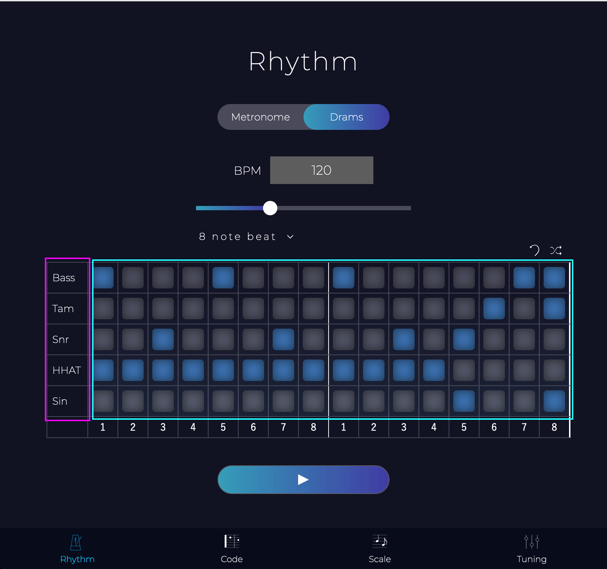

# 🎸Guitar_App

## Rhythm / リズム練習
- ### Metronome  
  4/4 ,3/4 ,2/4 対応

- ### Drams 
  
  - ### ドラムパターン変更
    ドラムの各パッド選択(青枠内)で音を鳴らす鳴らさないを変更できます。

  - ### 音色変更
    ドラムの各タグ(ピンク枠内)をクリックでモーダルが開きます。  
    モーダル内で下記変更すると音色が変更できます。
    - Release 音量が0になるまでの時間
    - Attack 発音してから最大音量になるまでの時間 この値が小さければ音は鋭く立ち上がり、値が大きければゆっくり立ち上がっていきます。
    - Volume 音量

## Scale / ギター・ベース用スケール一覧  
  7弦ギター 5弦ベースは非対応

## Code / ギターコード  
  レギュラーチューニングのギターコードです。  
  ベース・7弦ギターは非対応

## Tuning / ギター・ベースチューニング  
  マイクのアイコンクリックで端末のマイクが起動  
  端末に聞こえるようにチューニングしてください。
 